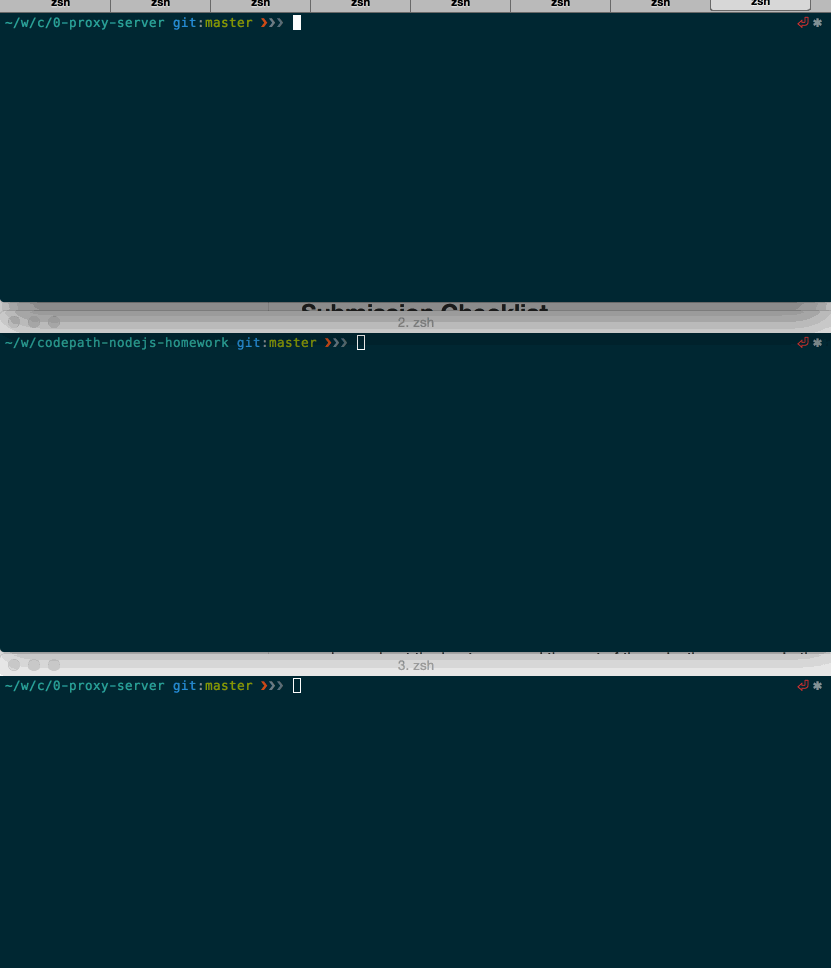

# codepath-nodejs-homework

## Home work 0

### Run server with nodemon

```
npm install -g eslint babel babel-eslint nodemon
cd 0-proxy-server
npm install
npm start
```

### Run proxy server with options

```
--host upstream host name, default 127.0.0.1
--port upstream port, default 8000 for 127.0.0.1, default 80 for others
--url upstream host:port, this will override --host and --port value
--log logfile path
```

Test it

```
babel-node -- index.js --host 127.0.0.1 --port 8000
curl -v http://127.0.0.1:8001/path -d "hello proxy"
```

### Check list

successfully echo requests

```
babel-node -- index.js
curl -v http://127.0.0.1:8000/path -d "hello proxy"
```

successfully proxy requests

```
babel-node -- index.js
curl -v http://127.0.0.1:8001/path -d "hello proxy"
```

CLI

```
babel-node -- index.js --host localhost --port 8000
curl -v http://127.0.0.1:8001/path -d "hello proxy"
```

log request to stdout

```
babel-node -- index.js --host localhost --port 8000 --log out.log
curl -v http://127.0.0.1:8001/path -d "hello proxy"
```

### Screenshot


